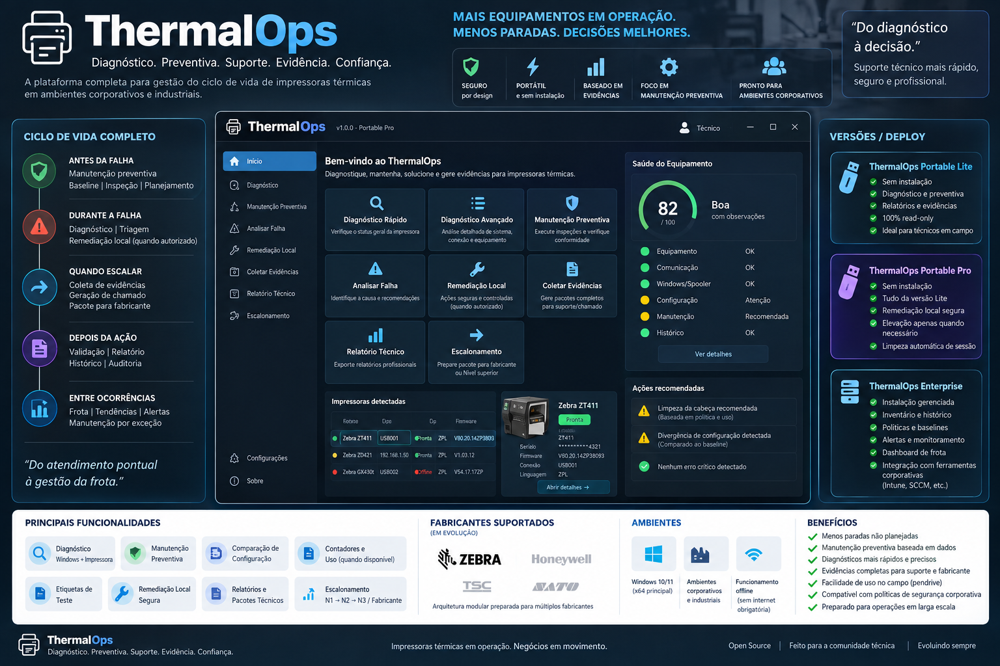

# ThermalOps

ThermalOps é uma plataforma Windows-first para **diagnóstico seguro, manutenção preventiva, field service, triagem, local remediation, coleta de evidências, escalation assistance e futura gestão de fleet/condition monitoring de impressoras térmicas**.

O primeiro adapter de fabricante será Zebra. A arquitetura é intencionalmente vendor-neutral para permitir Honeywell, TSC, SATO e outros fabricantes sem espalhar regras específicas pelo Domain.

> **Status do projeto:** M0 — fundações de produto, arquitetura, segurança, manutenção preventiva e field service. Nenhuma capacidade de diagnóstico físico, remediation, preventiva ou fleet deve ser considerada validada até cumprir os acceptance criteria, testes e validações de hardware previstos no roadmap.



> **Imagem conceitual.** A interface, versões, fabricantes, números, Health Score e textos mostrados são ilustrações da direção do produto, não evidência de funcionalidades já implementadas. A arte também pode conter termos promocionais ilustrativos que não representam status jurídico, de licenciamento ou certificação atual do projeto.

## Por que o ThermalOps existe

Em operações que dependem de impressoras térmicas, uma falha raramente pertence a uma única camada. O problema pode estar no Windows Print Subsystem, queue, job, driver, port, USB/PnP, network transport, configuração, consumível, estado físico reportado pelo equipamento ou em uma condição que o software sozinho não consegue observar.

O ThermalOps organiza essas evidências para responder, com rastreabilidade:

> **Qual é o estado desta impressora, o que pode ser tratado localmente com segurança e dentro da policy, e o que precisa ser escalado?**

O produto foi desenhado para ajudar em todo o ciclo operacional:

```text
ANTES DA FALHA
  -> Preventive Inspection / maintenance policy / baseline / checklist

DURANTE A FALHA
  -> Quick Diagnosis / Advanced Diagnostics / triage / local remediation

QUANDO O ESCOPO DE CAMPO TERMINA
  -> evidence / ServiceCase / escalation package

DEPOIS DA AÇÃO
  -> verify / before-after / report / history

ENTRE OCORRÊNCIAS (Enterprise)
  -> fleet / trends / drift / alerts / maintenance by exception
```

## Pilares do produto

```text
                         THERMALOPS
                              |
  +------------+--------------+--------------+--------------+
  |            |              |              |              |
  v            v              v              v              v
Diagnosis  Preventive     Local          Support        Observability
           Maintenance    Remediation    / Evidence     / Fleet
  |            |              |              |              |
  +------------+--------------+--------------+--------------+
                              |
                    Field Service / Escalation
```

### Diagnosis

Combina Windows, transport, vendor-native evidence e observações do técnico sem reduzir tudo a um simples `ONLINE/OFFLINE`.

### Preventive Maintenance

Usa tarefas com source/applicability, baseline, counters quando disponíveis, configuration drift, histórico e checklist humano. O ThermalOps não inventa intervalos ou vida útil de componentes.

### Local Remediation

`Repair` dentro do projeto significa remediation local, restrita e autorizada — por exemplo, cancelar um job selecionado ou executar um Spooler restart controlado. Não significa assumir que todo técnico pode desmontar ou reparar internamente a impressora.

### Support / Evidence

Cada conclusão deve apontar para evidence. Relatórios, support bundles, ServiceCase e escalation package preservam contexto para N1, N2/N3, assistência autorizada ou fabricante.

### Observability / Fleet

A edição Enterprise poderá adicionar inventory, maintenance history, condition trends, configuration drift, alerting e maintenance by exception após ADRs específicos de persistência, autenticação e operação distribuída.

## Edições

| Edição | Uso principal | Persistência | Writes |
| --- | --- | --- | --- |
| **Portable Lite** | Field/N1, diagnóstico e preventiva | Nenhuma intencional | Não; read-only por design |
| **Portable Pro** | N2/N3, field support e remediation controlada | Nenhuma intencional | Somente operações allowlisted e confirmadas |
| **Enterprise** | Fleet, histórico, policies, schedules e condition monitoring | Gerenciada | Controlado por policy/RBAC |

### Portable Lite

Deve funcionar sem installer, sem .NET previamente instalado, sem login, sem internet obrigatória e sem UAC. Continua útil para Quick Diagnosis, Advanced Diagnostics read-only, Preventive Inspection, baseline comparison, checklist, relatórios e preparação de escalation.

### Portable Pro

Adiciona local remediation e operações que podem exigir elevação. A UI continua em standard-user e eleva somente um **Temporary Privileged Helper** para a operação allowlisted específica.

### Enterprise

Adicionará instalação gerenciada, inventory/history, preventive schedules, baselines, alerting, condition trends e controles corporativos. A arquitetura Enterprise não pode transformar o helper portátil em um serviço privilegiado irrestrito.

## O que o ThermalOps pretende observar

### Windows print path

- Print Spooler state e configuração relevante;
- installed printers e target queue;
- jobs e estados de erro/stall;
- driver identity/version/package evidence;
- ports e print processors;
- USB/PnP evidence;
- Windows Event Log relacionado a impressão;
- access denied, timeout e coleta indisponível como evidence de primeira classe.

### Transport

- USB / DOT4;
- TCP/IP RAW;
- TLS printer channel quando suportado;
- LPR;
- Windows shared printer;
- Bluetooth;
- serial / parallel;
- browser/local bridge;
- known-endpoint reachability quando a policy autorizar.

ICMP nunca é tratado como prova de printer health.

### Vendor-native

No adapter Zebra, usar Link-OS, SGD, ZPL e interfaces suportadas quando apropriado e validado. Potenciais evidências incluem readiness, head state, media/ribbon state, pause, temperatura, firmware, counters/odometer, selected read-only configuration e device-reported warnings/errors.

Windows queue status e physical-device status permanecem fontes distintas.

## Preventive Maintenance

A preventiva é uma capability de primeira classe:

```text
Automatic evidence
+ source-backed MaintenancePolicy
+ applicable MaintenanceBaseline
+ TechnicianObservation / checklist
+ history/counters quando disponíveis
= MaintenanceFinding + recommendation + ServiceDisposition
```

O sistema deve suportar estados como `Unknown`, `NotDue`, `DueSoon`, `Due`, `Overdue`, `Blocked` e `NotApplicable` sem transformar ausência de informação em “healthy”.

Configuration drift é uma finding, não prova automática de defeito. Um Health Score numérico, se existir, será secundário, deterministic, versioned e totalmente explicável.

Detalhes: [Preventive Maintenance](docs/produto/manutencao-preventiva.md).

## Field Service e Escalation

O produto não assume que o operador é bench-repair technician. O outcome de uma sessão pode ser representado por `ServiceDisposition`:

```text
ContinueInService
ContinueWithObservation
LocalRemediationAllowed
EscalateToAuthorizedService
RemoveFromService        # somente quando a policy permitir
InsufficientEvidence
```

A regra exata varia por organização, contrato, fabricante e site. Processos proprietários permanecem fora do public core.

Detalhes: [Field Service, Triage e Escalation](docs/produto/field-service-e-escalation.md).

## Portable workflow

```text
Approved USB / local copy
        |
        v
ThermalOps.exe
        |
        +--> Quick Diagnosis
        +--> Preventive Inspection
        +--> Advanced Diagnostics
        +--> Analyze Failure
        +--> Collect Evidence
        +--> Prepare Escalation
        |
        +--> approved local remediation --UAC--> Temporary Privileged Helper
        |
        +--> Verify / before-after
        +--> sanitized report / full bundle / ServiceCase
        +--> cleanup / no intentional persistence
```

Requisitos centrais:

- self-contained .NET publish;
- no installer na edição Portable;
- no dependency setup manual;
- no account obrigatório;
- no internet obrigatória;
- no reboot no fluxo normal;
- no CLI necessário para uso normal;
- session staging em `%TEMP%`, nunca automaticamente no USB;
- `--readonly` como hard guardrail;
- Customer Safe profile;
- Authenticode quando houver signing identity de produção.

## Segurança

ThermalOps é safety-sensitive support software. Alguns princípios são não negociáveis:

- read-only por padrão;
- least privilege;
- no arbitrary PowerShell/cmd/shell endpoint;
- no broad spool-folder deletion para resolver um job específico;
- no automatic broad network scan;
- no automatic customer-data upload;
- imported policy/baseline é untrusted data;
- policy pode reduzir capability, nunca criar capability ausente do build;
- AI não autoriza nem executa repair, maintenance due ou disposition;
- ações com write seguem `Preflight -> Snapshot -> Execute -> Verify -> Recovery/Rollback -> Post-condition`;
- Portable não deixa serviço, scheduled task, startup entry, daemon/helper persistente ou log oculto após um clean exit.

Veja [Security e Privacy](docs/seguranca/security-e-privacy.md).

## Idioma, localização e terminologia

O repositório e a documentação de produto são **pt-BR por padrão**, mas os termos técnicos que pertencem ao ecossistema, Domain ou APIs permanecem em inglês quando isso melhora precisão e manutenção.

Exemplos mantidos em inglês:

```text
Domain
Application
Infrastructure
Adapter
Policy
Baseline
ServiceCase
ServiceDisposition
RepairPlan
HealthAssessment
Quick Diagnosis
Preventive Inspection
Spooler
WinSpool
PnP
Event Log
Link-OS
SGD
ZPL
CI/CD
SBOM
RBAC
```

O código C#, nomes de classes/métodos/interfaces, schemas e contracts internos permanecem em inglês. A UI será localization-ready, com `pt-BR` como locale inicial de referência e possibilidade futura de `en-US`, `es` e outros locales sem duplicar business logic.

Detalhes: [Localização e Terminologia](docs/produto/localizacao-e-terminologia.md).

## Stack e arquitetura

Decisão inicial:

- C#;
- .NET 10 LTS;
- WPF para o primeiro Windows client;
- modular monolith;
- Domain/Application independentes de UI, Windows implementation, vendor SDK e AI;
- Windows Infrastructure usando APIs suportadas;
- vendor adapters separados;
- Temporary Privileged Helper com IPC estreito e tipado;
- self-contained publishing para Portable.

Veja [Arquitetura](docs/engenharia/arquitetura.md) e os [ADRs](docs/adr/).

## Estrutura da documentação

```text
docs/
├── README.md
├── produto/
│   ├── visao-do-produto.md
│   ├── portable.md
│   ├── manutencao-preventiva.md
│   ├── field-service-e-escalation.md
│   ├── fleet-e-condition-monitoring.md
│   ├── ai-e-knowledge-assistance.md
│   └── localizacao-e-terminologia.md
├── engenharia/
│   ├── arquitetura.md
│   ├── diagnostico-e-remediacao-local.md
│   ├── deployment-e-lifecycle.md
│   ├── support-bundles-e-service-cases.md
│   ├── testing.md
│   └── release-engineering.md
├── seguranca/
│   └── security-e-privacy.md
├── pesquisa/
│   └── referencias-e-padroes.md
├── planejamento/
│   └── roadmap.md
├── adr/
└── assets/
```

A separação é deliberada: produto, engineering, security, research e planning não ficam misturados no mesmo nível.

## Roadmap

| Milestone | Resultado principal |
| --- | --- |
| **M0** | Product, security, preventive e field-service foundations |
| **M1** | Read-only Windows Diagnosis foundation |
| **M2** | Safe Local Remediation |
| **M3** | Zebra native adapter |
| **M4** | Support + Preventive Suite |
| **M5** | Enterprise hardening + deployment lifecycle |
| **M6** | Fleet + Condition Monitoring |
| **M7** | Multi-vendor adapters |
| **M8** | Knowledge / AI assistance |
| **M9** | Predictive-maintenance research, não uma feature prometida |

Veja o [Roadmap completo](docs/planejamento/roadmap.md).

## Engineering Constitution

Toda implementação deve seguir [ENGINEERING_CONSTITUTION.md](ENGINEERING_CONSTITUTION.md). Ela define prioridade de business correctness, safety/security, privacy/authorization, reliability, maintainability, testing, observability, UX, supply chain e honest status.

## Licença

A licença do projeto **ainda não foi selecionada**. Código-fonte publicamente visível não é automaticamente reutilizável. Até a decisão formal, não copie implementação de terceiros sem revisão explícita de licença, atribuição, manutenção e segurança.
